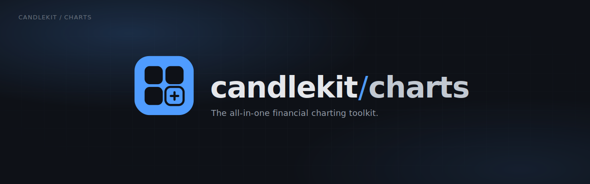

<div align="center">



# @getcandlekit/charts

**A tree-shakeable financial charting toolkit for the web.**

Candlestick · OHLC · line · area · volume · drawing tools · pluggable indicators · measurement ruler · deterministic replay engine.<br />
A framework-agnostic core with optional React bindings, built on [Lightweight Charts™](https://github.com/tradingview/lightweight-charts).

<p>
  <em>A clean, extensible layer over lightweight-charts — the orchestration you keep rewriting, packaged once.</em>
</p>

[](https://github.com/rohanbeingsocial/candlekit-charts/actions)
[](https://www.npmjs.com/package/@getcandlekit/charts)
[](./LICENSE)

</div>

> [!NOTE]
> **Candlekit is a vibe-coded project** — designed and built rapidly and iteratively with AI-assisted development. It is functional, tested, and documented, but treat it as early-stage software: pin a version, read the changelog before upgrading, and open an issue if something looks off.

<p align="center">
  
  <br />
  <em>Drawing tools — trendline, rectangle, Fibonacci, measurement ruler</em>
</p>

<p align="center">
  
  <br />
  <em>Built-in indicators — Bollinger, EMA/SMA, RSI, MACD, Stochastic — toggled live</em>
</p>

<p align="center">
  
  <br />
  <em>Measurement ruler — Shift-drag for % move, points, bars · time</em>
</p>

<p align="center">
  <strong><a href="https://rohanbeingsocial.github.io/candlekit-charts/workspace/">▶ Open the live demo</a></strong>
  — drawing, indicators, measurement and replay in one chart
</p>

---

## Overview

`@getcandlekit/charts` wraps lightweight-charts with the pieces a real trading UI
needs but the base library leaves to you: a stable chart controller, a
runtime-agnostic drawing engine, an extensible indicator framework, a Shift-drag
measurement ruler, multi-chart sync, and a deterministic historical replay
engine. The **core is framework-agnostic** (no React, no DOM framework); the
optional **`/react` entry** adds components and hooks.

It is **plugin-first**: drawing, indicators, and measurement are all `ChartPlugin`s
you can swap, extend, or omit. Drawing tools and indicators are **original code**
built on lightweight-charts canvas primitives — no third-party drawing or indicator
runtime — and the side-effect-free modules let tree-shaking drop whatever you don't
import.

## Features

- **Core charting** — candlestick, OHLC bars, line, area, volume; multiple
  timeframes via a session-aware resampler; responsive auto-resize; light/dark
  themes with full color override.
- **Drawing tools** — trend line, ray, extended line, horizontal/vertical line,
  arrow, rectangle, circle, Fibonacci retracement, with selection, drag-to-move,
  handle reshaping, locking, and persistence. Original engine rendered on
  lightweight-charts canvas primitives — no third-party drawing runtime.
- **Indicators** — extensible registry + a built-in catalog (SMA, EMA, WMA,
  VWAP, Bollinger Bands, RSI, MACD, ATR, Stochastic), all original
  implementations. Register your own with one call.
- **Measurement** — price, percentage, bar-distance, time-delta, and
  risk/reward, painted as a canvas ruler.
- **Replay** — deterministic playback over historical bars: play/pause, step
  ±1, speed control, seek/jump, per-bar event hooks, per-day LRU cache with
  pre-fetch.
- **Architecture** — TypeScript, fully typed public API, tree-shakeable ESM +
  CJS, event system, plugin system, and extensible data-source / indicator /
  drawing frameworks.

## Replay

<p align="center">
  
  <br />
  <em>Deterministic replay — play/pause, step ±1, speed control, seek/jump</em>
</p>

## Installation

```bash
npm install @getcandlekit/charts lightweight-charts
# React bindings (optional):
npm install react react-dom
```

That's it. `lightweight-charts` is the only runtime dependency (a peer, so you
control its version); `react`/`react-dom` are needed only for
`@getcandlekit/charts/react`. **Drawing tools and indicators are built in** — no
extra packages, no git installs.

## Quick Start

### Vanilla JS / TypeScript

```ts
import { ChartController, toBars } from "@getcandlekit/charts";

const el = document.getElementById("chart")!;
const chart = new ChartController(el, { theme: "dark", seriesType: "candlestick" });

chart.setData(toBars(myRows)); // myRows: { ts, open, high, low, close, volume }[]
```

### React

```tsx
import { ChartView } from "@getcandlekit/charts/react";
import "@getcandlekit/charts/styles.css";

export function App({ bars }) {
  return (
    <div style={{ height: 480 }}>
      <ChartView data={bars} seriesType="candlestick" theme="dark" />
    </div>
  );
}
```

## Basic Examples

**Switch series type and timeframe:**

```ts
chart.setSeriesType("area");       // candlestick | ohlc | line | area
chart.setData(resample(rows, 5));  // 5-minute candles from 1-minute rows
chart.setTheme("light");
```

**Live updates:**

```ts
ws.onBar((bar) => chart.updateBar(bar)); // appends or replaces the last bar
```

## Advanced Examples

**Session-aware resampling** (align buckets to a 09:30 market open instead of UTC midnight):

```ts
import { resample } from "@getcandlekit/charts";
const candles = resample(rows, 15, { sessionOpenMinutes: 9 * 60 + 30 });
```

**Fixed-offset exchange time** (render an always-UTC+5:30 market in wall-clock):

```ts
import { applyFixedOffset } from "@getcandlekit/charts";
const shifted = rows.map((r) => ({ ...r, ts: applyFixedOffset(r.ts, 330) }));
```

## Replay Examples

```ts
import { createReplayController } from "@getcandlekit/charts";

const replay = createReplayController();
replay.onBar((e) => chart.updateBar(e.bar));
await replay.load({
  id: "demo",
  series: [{ symbol: "AAPL", interval: "1m" }],
  start: Date.parse("2024-01-02T14:30:00Z"),
  end: Date.parse("2024-01-03T21:00:00Z"),
  source: myReplayDataSource, // implements ReplayDataSource
});
replay.setSpeed(8);
replay.play();
```

React transport bar:

```tsx
import { ReplayControls } from "@getcandlekit/charts/react";
<ReplayControls controller={replay} />
```

## Drawing Tool Examples

```tsx
import { ChartView, DrawingToolbar } from "@getcandlekit/charts/react";

// `drawing` accepts true, an options object, or a DrawingController instance.
<ChartView data={bars} drawing={{ storageKey: "drawings:AAPL" }}>
  <DrawingToolbar />
</ChartView>;
```

Imperative (vanilla):

```ts
import { ChartController, DrawingController } from "@getcandlekit/charts";

const chart = new ChartController(el);
const drawing = new DrawingController({ storageKey: "drawings:AAPL" });
chart.use(drawing);
drawing.engine.startTool("TrendLine");
```

## Indicator Examples

```tsx
import { ChartView, IndicatorPicker, IndicatorController, createBuiltinRegistry } from "@getcandlekit/charts/react";

const indicators = new IndicatorController(createBuiltinRegistry());
indicators.add("RSI", { length: 14 });
indicators.add("EMA", { length: 21 });

<ChartView data={bars} indicators={indicators}>
  <IndicatorPicker />
</ChartView>;
```

Register a **custom indicator** (the extension point):

```ts
import { IndicatorRegistry } from "@getcandlekit/charts";

const registry = new IndicatorRegistry().register({
  name: "PriceMid",
  title: "HL/2",
  shortTitle: "MID",
  category: "overlay",
  defaultInputs: {},
  inputConfig: [],
  plotConfig: [{ id: "mid", color: "#f59e0b" }],
  hlineConfig: [],
  calculate: (bars) => ({
    plots: { mid: bars.map((b) => ({ time: b.time, value: (b.high + b.low) / 2 })) },
  }),
});
```

## Plugin Examples

```ts
import type { ChartPlugin } from "@getcandlekit/charts";

const lastPriceLabel: ChartPlugin = {
  id: "last-price-label",
  init(ctx) {
    ctx.bus.on("data", ({ bars }) => {
      const last = bars[bars.length - 1];
      if (last) console.log("last close", last.close);
    });
  },
  destroy() {},
};

chart.use(lastPriceLabel);
```

## API Overview

| Export | Kind | Purpose |
| --- | --- | --- |
| `ChartController` | class | Imperative chart wrapper (data, series type, theme, plugins, events). |
| `toBars`, `resample`, `floorToBucket` | fn | Pure data normalization + session-aware resampling. |
| `resolveTheme`, `lightTheme`, `darkTheme` | fn/const | Theme presets + resolution. |
| `EventBus` | class | Typed sync event bus. |
| `DrawingController`, `DrawingEngine` | class | Built-in drawing plugin + its model/state. |
| `IndicatorRegistry`, `IndicatorController`, `createBuiltinRegistry` | class/fn | Extensible indicator framework + built-in catalog. |
| `MeasurementController`, `RulerPrimitive` | class | Shift-drag measurement. |
| `createReplayController` | fn | Deterministic replay. |
| `createSyncEngine` | fn | Multi-chart sync. |
| `ChartView` *(/react)* | component | Declarative chart + plugin host. |

Full reference: [docs/api-reference.md](docs/api-reference.md).

## Performance Notes

- Single offset conversion at the data boundary; drawings/replay stay in one
  coordinate domain (no per-render timezone math).
- `setData` autoscale fits once on the first non-empty paint; later updates
  preserve user pan/zoom.
- Replay uses a per-day LRU cache with backward/forward pre-fetch; the cursor
  drives everything (no wall-clock coupling).
- Tree-shakeable ESM — a vanilla bundle never pulls React. Drawing and
  indicators are self-contained (no extra runtime deps to load).

## Browser Support

Evergreen browsers (Chrome, Edge, Firefox, Safari) with Canvas + ResizeObserver.
ESM and CJS builds are shipped; `target: es2020`.

## Roadmap

- [ ] Text + freehand/brush drawing tools
- [ ] Indicator settings UI (param editing) in the React picker
- [ ] Crosshair tooltip component
- [ ] More indicators (Ichimoku, SuperTrend, Keltner)
- [ ] Vue / Svelte bindings
- [ ] Screenshot/export helper

## Contributing

See [CONTRIBUTING.md](./CONTRIBUTING.md) and [AGENTS.md](./AGENTS.md). In short:
`npm install`, `npm run typecheck && npm run lint && npm run test && npm run build`.

## License

MIT — see [LICENSE](./LICENSE). Third-party attributions in [NOTICE](./NOTICE).
"Lightweight Charts™" is a trademark of TradingView, Inc.; this project is not
affiliated with TradingView.
